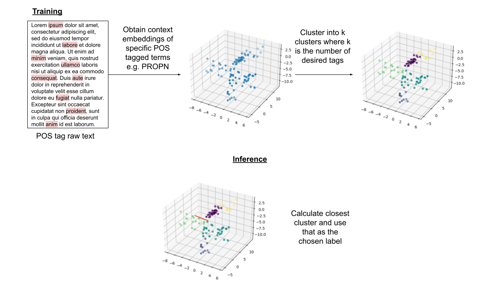

# Fully Unsupervised Named Entity Classification

This algorithm is designed to take preidentified entities in text and determine which entity type they are. From a training set, the activations of BERTs embedding layers are used, with some aggregation strategy, to calculate the context of the target terms. These context vectors are then clustered into $K$ where $K$ is the number of NER tags you want.

`FOREWARNING:` This algorithm does not perform exceptionally well. There may be means to improve this idea but as it is tangential to my research, I am leaving this here for now.



The code is designed to run on a GPU with a decent amount of VRAM for optimal performance. CPU works but it is very slow.

# Preparation

CoNLL2003 has been used as an annotated dataset for experiments on this model. The dataset must be first prepared using the `format_conll2003.py` script. By default, `BERT-base-cased` is used. To use a different version of BERT, this must be specified to the script as the vocabularies of different BERT models varies. For the script's input options, use:

```bash
python format_conll2003.py --help
```

This script converts CoNLL2003 from a BIO scheme to PER, ORG, LOC, MISC.

# Using the Model

The model makes use of a similar API structure to SKlearn, using a `fit`, `predict` function set. Example usage:

```python
from context_vector_clustering import ContextClustering

...

model = ContextClustering(n_clusters=4, random_state=42)
model.fit(dataset['train'])

# Note cluster IDs do not match NER IDs
cluster_ids = model.predict(dataset['validation'])
```

For a full example of usage, view `development_notebook.ipynb`.

## Aggregation Methods

Different aggregation strategies have been supplied for combining BERT embedding layers.

| Strategy     | Params     | Description |
| ------------ | ---------- | ----------- |
| SelectLayerN | n          | Extracts a single layer, as specified by n. |
| SumNLayers   | start, end | Sums sequential layers between the specified bounds. |
| MeanNLayers  | start, end | Averages sequential layers between the specified bounds. |
| CatNLayers   | start, end | Concatenates sequential layers between the specified bounds. |

These methods can be imported form the same file:

```python
from context_vector_clustering import CatNLayers, SumNLayers, ...

agg = CatNLayers(-4, None)
...
```

## Subtoken Aggregation

A class for aggregating BERT's subtokens (e.g. ##a, ##tion) is also supplied. This combines all subtokens for a specific word into a single context vector instead of many separate context vectors. Two functions can be passed to this class as aggregation strategies: `torch.sum` and `torch.mean`. Can be imported the same way as everything else:

```python
from context_vector_clustering import AggregateSubtokens

agg = AggregateSubtokens(torch.sum)
...
```

## Thresholding

To experiment with the MISC class in CoNLL2003, the option to set a threshold while predicting with the model is provided. `NOTE:` You must set your `n_clusters` parameter to be $K - 1$ as in CoNLL2003, MISC is one of the tags, ergo you don't want to define a cluster for it when calling anything outside of your threshold MISC. Any values larger than the threshold will be added to the `-inf` class i.e. MISC.

```python
num_tags = 4
num_clusters = num_tags - 1

model = ContextClustering(n_clusters=num_clusters, random_state=42)
model.fit(dataset['train'])

cluster_ids = model.predict(dataset['validation'], threshold=0.3)
```

# Experiments

A grid search was performed to find the best combination of parameters. For each combination of parameters, the experiment was run 3 times with different seeds (`0`, `42`, `100`) to account for any anomalous performance. An evaluation method was written to find the best mapping of predicted cluster labels to actual tags, where the best accuracy was taken to be the accuracy for that combination of parameters. To isolate only determining which class the token belongs to, all tokens with an NER tag that isn't `O` were selected.

The following ranges were used in the grid search:

Aggregation Strategies: `CatNLayers`, `SumNLayers`, `MeanNLayers` <br>
Layer Ranges: `(-2, None)`, `(-3, None)`, `(-4, None)` i.e. last 2, 3, or 4 layers<br>
Subtoken Aggregations: `None`, `torch.sum`, `torch.mean` <br>
Thresholds: `None`, `0.1`, `0.2`, `0.25`, `0.3`, `0.35`, `0.4`, `0.45`, `0.5`, `0.55`, `0.6`

The grid search code can be found in `grid_search.py`.

## Results
[TO BE COMPLETED]